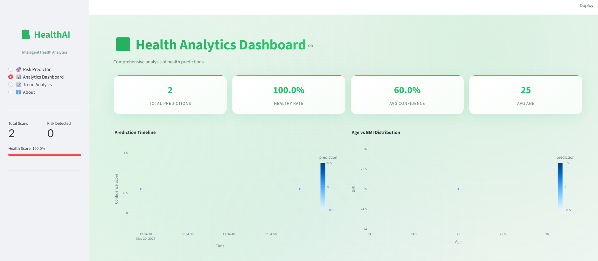
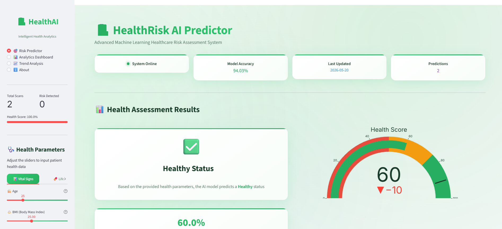
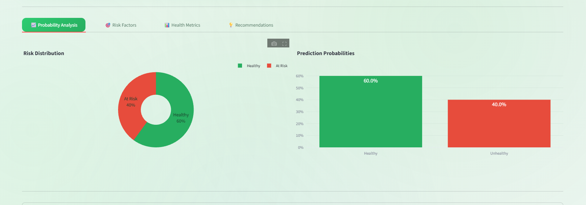
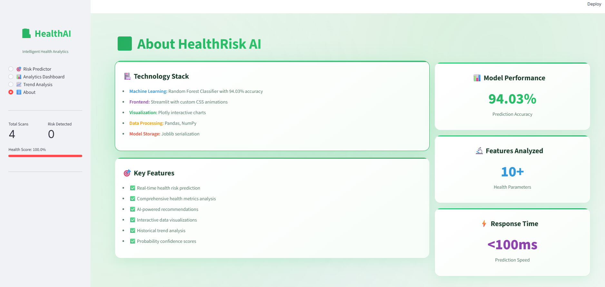

# HealthRisk Predictor

AI-powered healthcare risk prediction system built using Supervised Machine Learning, Streamlit, and interactive healthcare analytics.

---

## Overview

HealthRisk Predictor is an end-to-end machine learning application designed to classify individuals into:

* Healthy
* Higher Health Risk

based on physiological, lifestyle, and medical indicators.

The project combines:

* machine learning
* healthcare analytics
* explainable AI
* interactive dashboard engineering

into a deployable Streamlit application.

---

## Key Features

* Real-time healthcare risk prediction
* Random Forest classification model
* Interactive analytics dashboard
* Explainable AI using feature importance
* Advanced Plotly visualizations
* Professional Streamlit UI
* Live prediction probability analysis

---

## Machine Learning Pipeline

### Data Processing

* Data cleaning
* Exploratory Data Analysis (EDA)
* Feature engineering
* Feature scaling

### Models Trained

| Model               | Accuracy |
| ------------------- | -------- |
| Logistic Regression | 82.25%   |
| Decision Tree       | 89.27%   |
| Random Forest       | 94.03%   |

### Final Selected Model

Random Forest Classifier

---

## Important Predictive Features

The model identified the following high-impact health indicators:

* BMI
* Blood Pressure
* Cholesterol
* Stress Level
* Glucose Level
* Sleep Hours

---

## Tech Stack

| Technology     | Purpose                   |
| -------------- | ------------------------- |
| Python         | Core Development          |
| Scikit-learn   | Machine Learning          |
| Streamlit      | Web Application           |
| Plotly         | Interactive Visualization |
| Pandas / NumPy | Data Processing           |
| Joblib         | Model Serialization       |

---

## Application Screenshots

### Dashboard



---

### Prediction System



---

### Analytics Dashboard



---

### About Section



---

## Local Installation

Clone repository:

```bash id="jlwm4w"
git clone https://github.com/ArbazCod/HealthRisk-Predictor.git
```

Install dependencies:

```bash id="jlwm8s"
pip install -r requirements.txt
```

Run application:

```bash id="jlwm2t"
streamlit run app.py
```

---

## Repository Structure

```text id="jlwm6l"
HealthRisk-Predictor/
│
├── app.py
├── health_risk_model.pkl
├── novagen_dataset.csv
├── requirements.txt
├── README.md
├── screenshots/
└── HealthRisk_Predictor.ipynb
```

---

## Future Enhancements

* XGBoost integration
* Hyperparameter optimization
* SHAP explainability
* Cloud deployment
* REST API integration
* Real-time monitoring

---

## Developer

Arbaz

---
